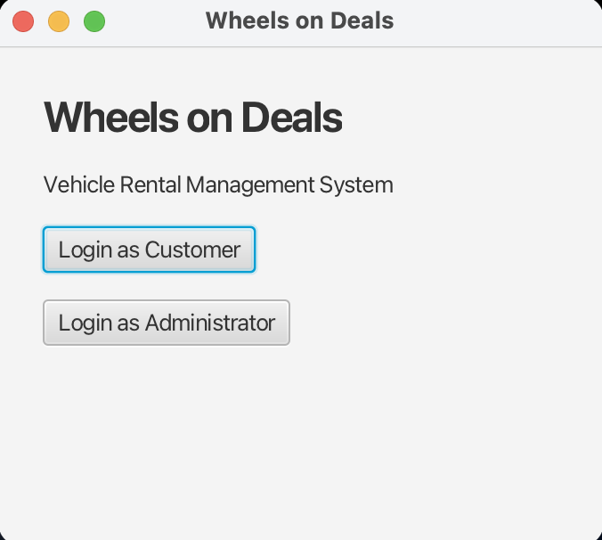
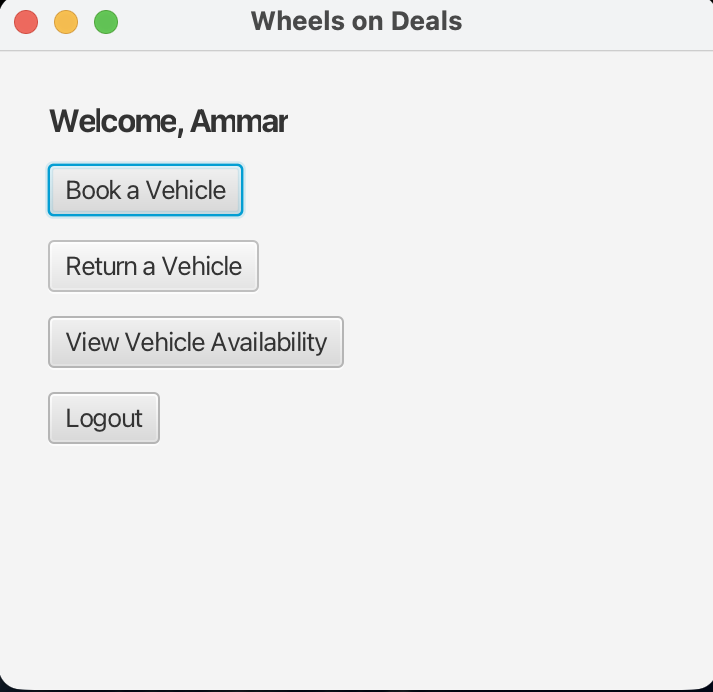
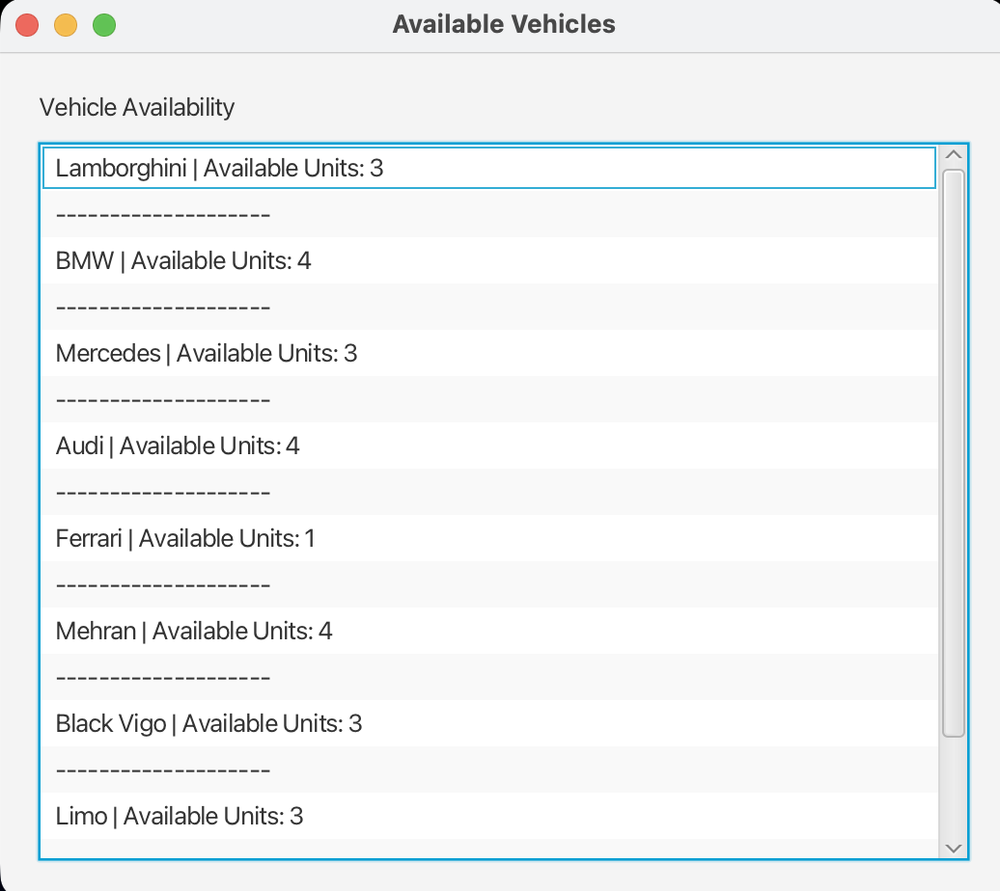
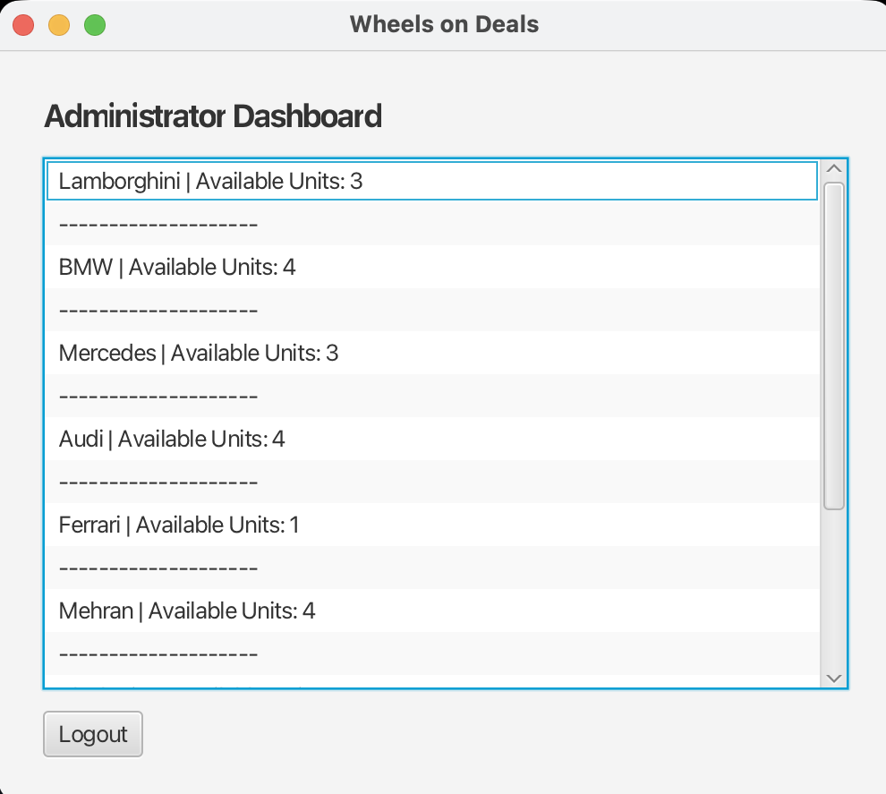

# Wheels on Deals — Vehicle Rental System

A JavaFX-based Vehicle Rental Management System built in Java. Developed as a Semester 1 project to practice multi-method programming, GUI design, and separation of UI and backend logic.

---

## Business Problem

How can a small vehicle rental business manage bookings, track availability, and handle returns — without a spreadsheet?

This system answers that by providing a simple desktop application for both customers and administrators.

---

## Features

- Dual login — Customer and Administrator roles
- Book vehicles for a specified number of days
- Automatic rental cost calculation
- Return vehicles and update availability in real time
- Admin dashboard showing full fleet status
- Input validation and basic error handling

---

## Screenshots

**Login Screen**


**Customer Dashboard**


**Vehicle Availability (Customer View)**


**Administrator Dashboard**


---

## Fleet

| Vehicle | Daily Rate (PKR) | Available Units |
|---|---|---|
| Lamborghini | 45,000 | 3 |
| BMW | 55,000 | 4 |
| Mercedes | 60,000 | 3 |
| Audi | 60,000 | 4 |
| Ferrari | 90,000 | 1 |
| Mehran | 5,000 | 4 |
| Black Vigo | 20,000 | 3 |
| Limo | 120,000 | 3 |
| JAC | 18,000 | 4 |

---

## How to Run

1. Clone the repository
```bash
git clone git@github.com:m2ammar/VehicleRentalSystem.git
```
2. Open in IntelliJ IDEA
3. Make sure JavaFX SDK is configured
4. Run `BookingVehicleFX.java`

---

## What I Learned

- Separating UI logic (JavaFX) from backend logic (plain Java class)
- Managing state across multiple screens without a database
- Input validation and user feedback via alerts
- Multi-method design — breaking functionality into single-purpose methods

---

## Tech Stack


